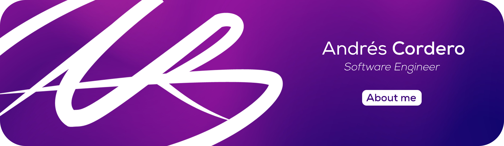

# Hello partner! 

## 🦾 I'm a Systems and Software Engineer!

My name is Andrés Cordero and I'm a software developer/enginer from Mexico.

- 🌱 I’m a constant learner, not only I learn about software, but about life.
- 🎁 I love getting into new projects and creating
- 🥅 Next Goals: Learning the most used technologies and tools.
- ⚡ I love music, films and art.

## 🤝 Connect with me:

 
 
 
 

## 🔧 Experience with:

 
 
 
 
 
 

  ## &#x1f4c8; My GitHub stats

  

